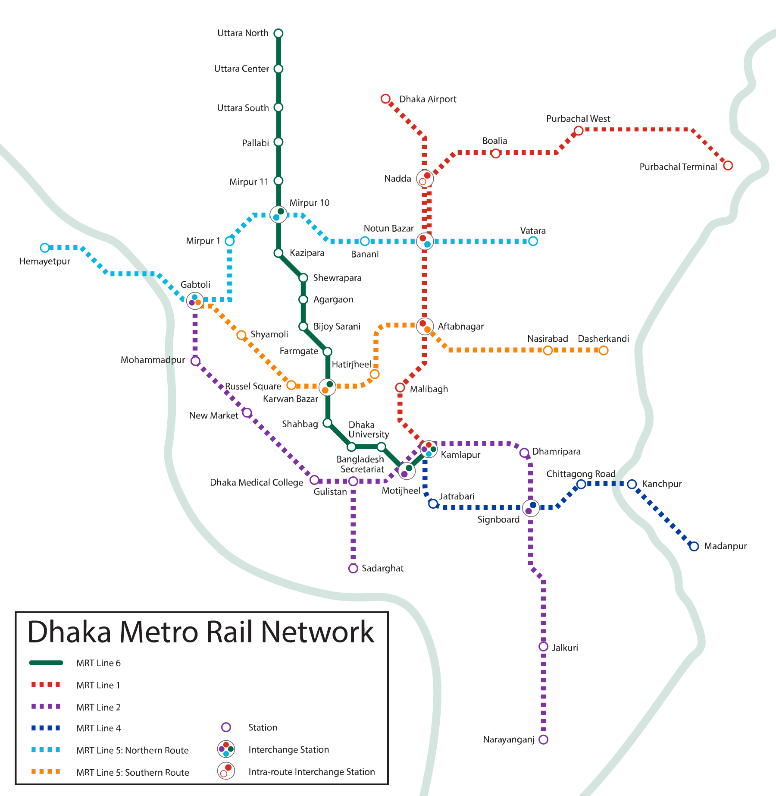

# Dhaka Metro AR Map — Setup Guide

Point your phone at the printed card or a screen showing the card to see the full MRT map floating above it.



---

## Step 1 — Install

```bash
cd dhaka-ar-metro
npm install
```

---

## Step 2 — Start the HTTPS server

Camera access on your phone **requires HTTPS**. Keep this running.

```bash
npm run serve:https
```

The terminal will print a URL like:

```
https://192.168.x.x:3443/index.html
```

Note this URL — you'll need it for the QR code and your phone.

---

## Step 3 — Update the QR code (if needed)

The QR code on the card should point to the URL shown in Step 2.  
If it doesn't match your network, regenerate it:

```bash
AR_URL=https://192.168.x.x:3443/index.html npm run export-card
```

Replace `192.168.x.x` with the IP shown in your terminal.  
The card image is `assets/Metro card.png`.

---

## Step 4 — Compile the tracking file

Do this on your **PC** (not the phone).

1. Open **https://localhost:3443/compile-target.html** in Chrome.
2. Click **Compile assets/Metro card.png**.
3. Wait 30–60 seconds until you see **SUCCESS — targets.mind saved**.

You only need to redo this step if you change the card image.

---

## Step 5 — Print the card or use a screen

Use `assets/Metro card.png` as your AR target. Either option works:

**Option A — Print**
| | |
|---|---|
| **Recommended size** | **A6 landscape** (~148 × 105 mm) or postcard size |
| **Minimum size** | Credit-card size (tracking will be weaker) |
| **Paper** | Matte cardstock or photo paper — avoid glossy |

Print at 100% scale. Do not crop the QR code.

**Option B — Screen**
Open `assets/Metro card.png` on another phone, tablet, or monitor and point your camera at it. Good for quick testing — printed cards usually track more reliably.

---

## Step 6 — Open AR on your phone

1. Phone and PC on the **same Wi-Fi**.
2. Open the URL from Step 2, or scan the QR on the card.
3. **First visit:** Chrome → **Advanced** → **Proceed** (self-signed certificate warning is normal).
4. Tap **Allow** for camera access.
5. Use **Chrome on Android**. Safari on iOS has limited Web AR support.
6. Point the camera at the printed card or screen from Step 5. Pinch or use **+/−** to zoom the map.

---

## Troubleshooting

| Problem | Fix |
|---------|-----|
| Connection not secure | Use `npm run serve:https`, not plain `http://` |
| Browser not compatible | Use Chrome on Android; avoid in-app browsers (WhatsApp, Facebook) |
| Camera never asks | Must be HTTPS; accept the certificate warning first |
| Map does not stick to card | Recompile at https://localhost:3443/compile-target.html |
| QR opens wrong URL | Run `AR_URL=https://your-ip:3443/index.html npm run export-card`, reprint, recompile |

---

## Other things you can build with this

Swap out `Metro card.png` and the overlay image — the AR engine stays the same.

| Idea | Card | Overlay |
|------|------|---------|
| 🎂 **Birthday card** | Printed birthday card | Animated cake / fireworks scene |
| 🏫 **Campus map** | University brochure | Interactive building labels |
| 🎮 **Board game** | Game board card | 3D character or game stats |
| 🪪 **Business card** | Your name card | Portfolio / contact links in AR |
| 🌍 **Travel poster** | City poster | Landmark info + photos |
| 🍽️ **Restaurant menu** | Table card / coaster | Dish photos floating above |
| 🎵 **Album cover** | CD / vinyl sleeve | Music visualizer or artist info |

Replace `assets/Metro card.png` with your card image, replace the overlay PNG, recompile `targets.mind`, done.

---

## Optional — regenerate map overlay

If you update `assets/dhaka-metro-map.svg`:

```bash
npm run export-overlay
```

No need to recompile `targets.mind` unless the **card** image changed.
